Statistical Learning Presentation

Project Analysis
Explain The Dataset
Define The Problem
Preprocess the Data
PROJECT
Data Cleaning
Exploratory Data Analysis
Clustering with Map
(EDA)
Modelling
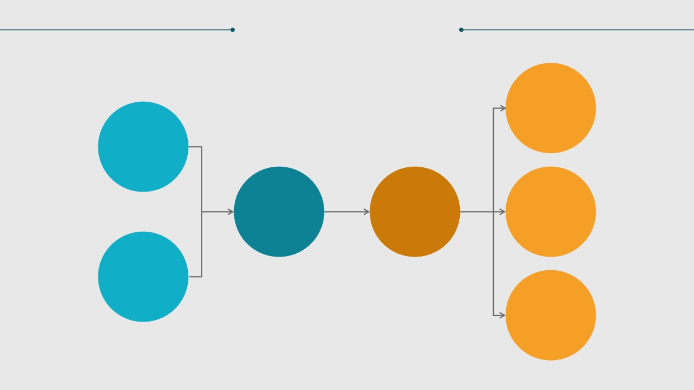
Project Analysis
Clustering with
Map
Explain The
Dataset
Exploratory
Preprocess the
Data Cleaning
Data Analysis
Data
(EDA)
Define The
Problem
Modelling
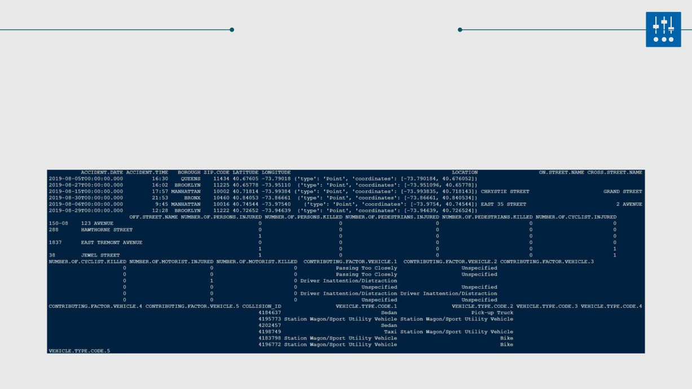
Explain The Dataset
The Motor Vehicle Collisions crash table contains details on the crash
event.
The Motor Vehicle Collisions data tables contain information from all
police-reported motor vehicle collisions in NYC.
The police report (MV104-AN) is required to be filled out for collisions
where someone is injured or killed, or where
there is at least \$1000 worth of damage
A brief summary of data with head() function
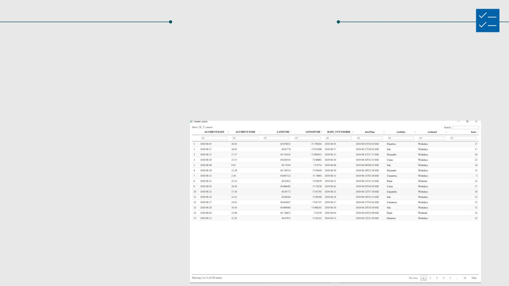
Objectives
1.
The Problem : Big amount of accidents on daily basis
2. Download data on the kaggle
3. Import the data to R Studio
4. Visualize accidents and locations.
5. Select the variables in the dataset from the dataset as required.
(date/location/time etc...)
6. Solution : Estimate the potential traffic accident area based on
current locations.
With data \<- data\_try %\>% select(ACCIDENT.DATE, ACCIDENT.TIME,
LATITUDE, LONGITUDE)
We select our variables
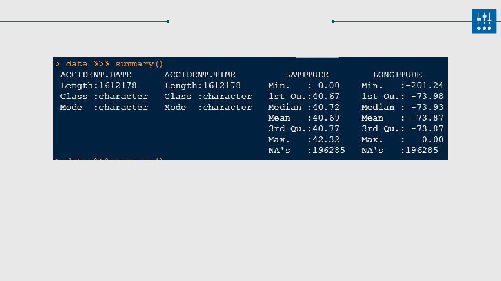
Summary of The Data
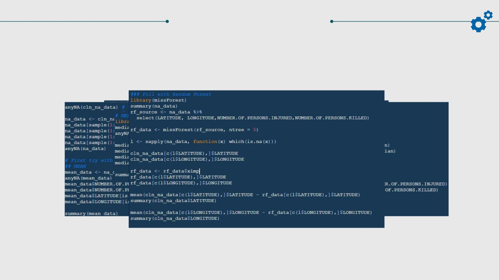
Data Cleaning
In fact, we wanted to do a data manipulation here because the location
variables in the data were too large.
For this we would use knn, random forest to do an undefined value
tuning.
However, this process takes too long (because we do not have enough
processing power). Here is a simple data
editing
data \<- data %\>% filter(LATITUDE\>0, LONGITUDE\<-72, LONGITUDE\>-75)
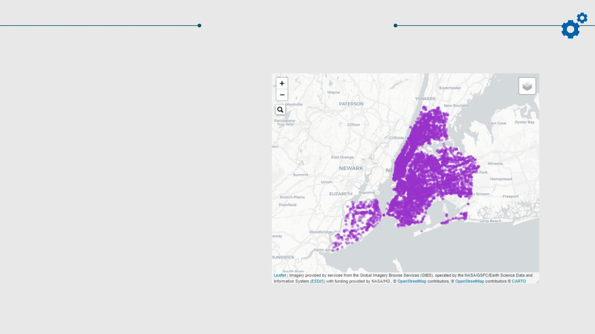
Create a Map
When I look at the summary results,
We took the map on the right and it with 7500
samples.
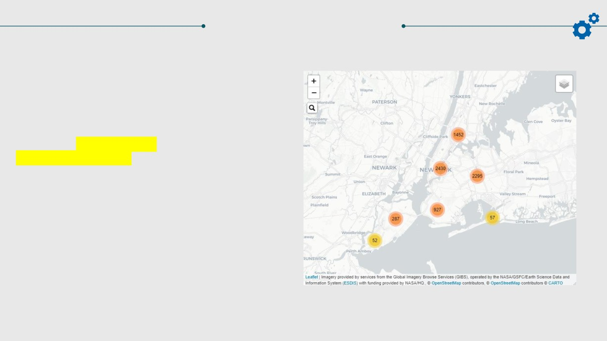
Map with Clustering
Thanks to that piece of code
addCircleMarkers(\~LONGITUDE, \~LATITUDE,
radius = 1,
color = "brown", fillOpacity = 0.005,
clusterOptions =
markerClusterOptions()) %\>%
We can organize our maps data.
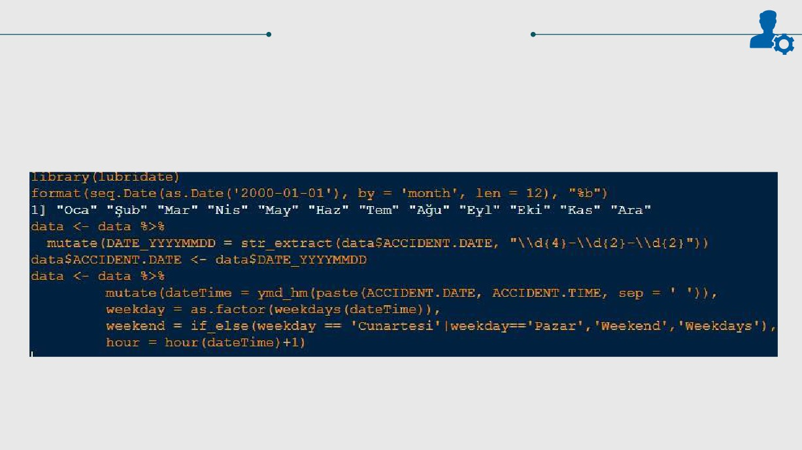
Making and Converting
• We converted date time to time series data and created variables such
as hour, weekday, weekend, etc.
• Hour is denoting 24 hours a day.
• However, we had to write the days in Turkish because the system
language of the computer we applied was Turkish.
So: Saturday = Cumartesi, Sunday = Pazar,
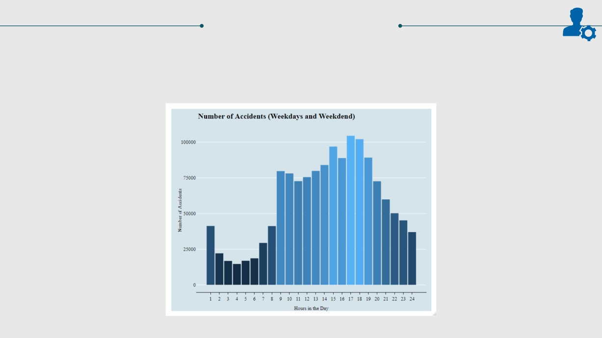
Exploratory Data Analysis
(EDA)
• When we look at the number of accidents according to the time schedule
of the day, there is an increase in
accidents almost regularly.
• However, we can see that this increase ended at 17 \~ 18 hours.
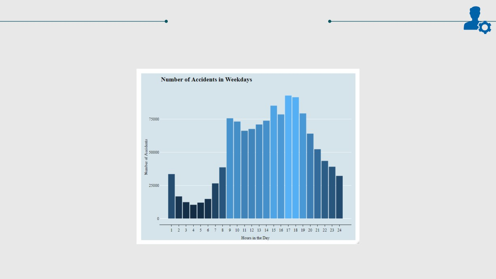
Accident in Weekdays
• It is the same as the observations from the data set, which is
slightly higher in the morning.
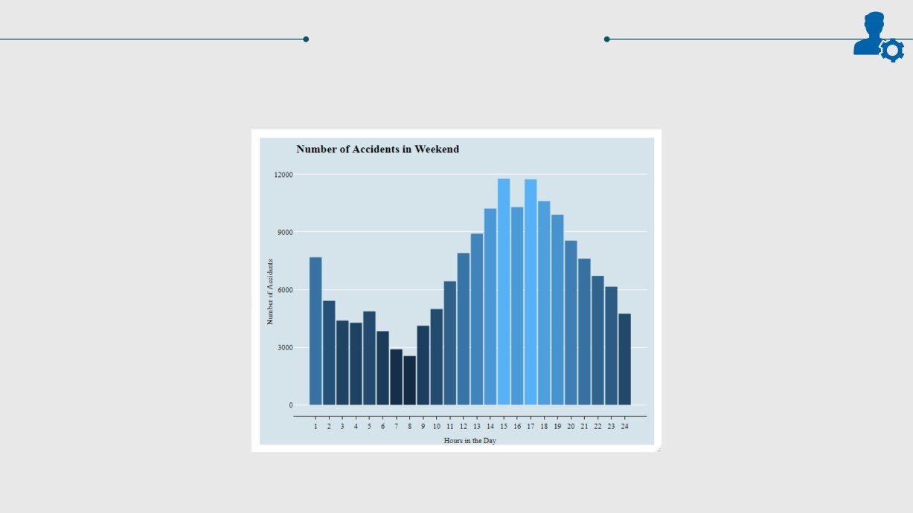
Accident in Weekends
• For the weekend, the graph has changed in appearance, and the peak
takes place between 15 and 17
hours.
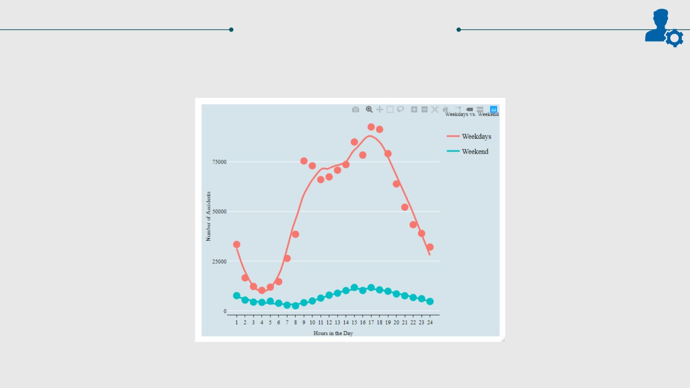
Weekdays vs Weekend
• If we compare the weekdays and weekend tables, we can say that people
drive less risky vehicles on
weekends.
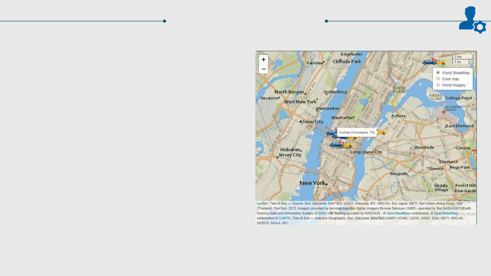
Top 10 Dangerous Areas in
Weekdays
• Instead of directing the calculation of the top
10 accident locations, we processed the data
a bit.
• If We use direct longitude and latitude data,
the same collection point with slightly
different coordinates is considered to be
different collection locations and will
definitely deviate from the actual result.
• Therefore, I rounded up to 3 decimal places
without making a huge change to longitude
and latitude. We also uploaded a picture to
Ogulcan's blog to indicate the accident sites
and used that picture as an icon. The
graphic is interactive and can zoom in and
out. If you place the mouse over the crashed
car icon, it shows how many accidents are in
the position according to the data set.
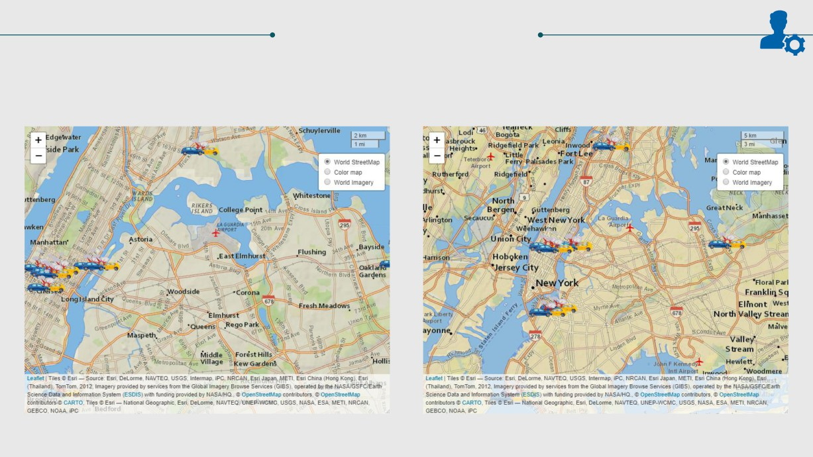
Top 10 Dangerous Areas in
Weekends
• The locations of the vehicles, namely the regions where the most
accidents occur, change directly on
weekends and weekdays.
WEEKDAYS
WEEKEND
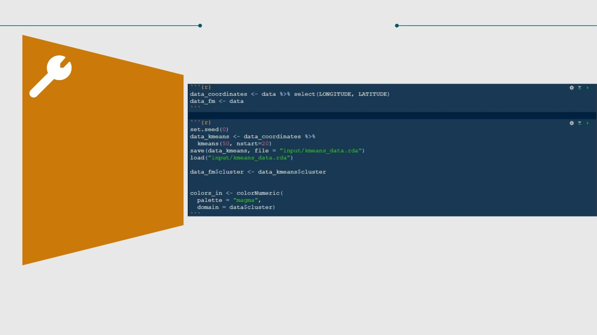
Modelling
Modelling
After examining all the
accidents, we prepared a
simple kmeans model to
divide the accident points
into 50 groups to suggest a
potential accident point.
With unsupervised learning,
we got a simple but
functional result.
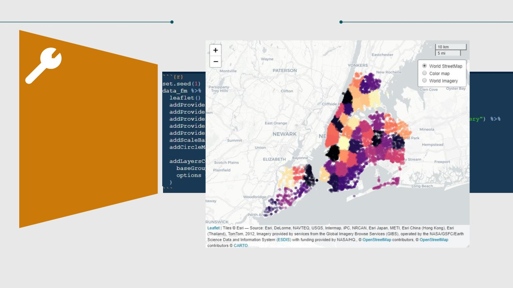
Modelling
New Map
Finally, we created a new car
accident map using the
kmeans model.
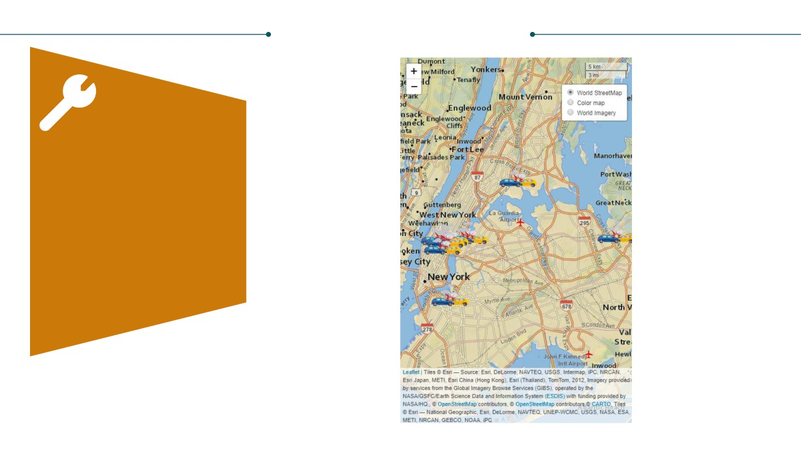
Modelling
New Top 10
Estimated
Dangerous
Area Map
on
Weekdays
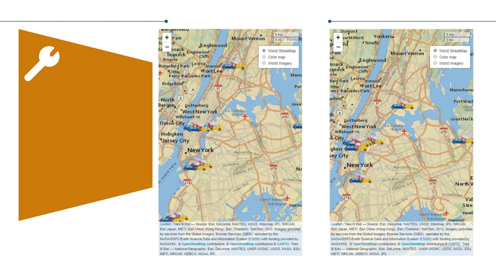
Modelling
New Top 10
Estimated
Dangerous
Area Map
WEEKENDS
WEEKDAYS
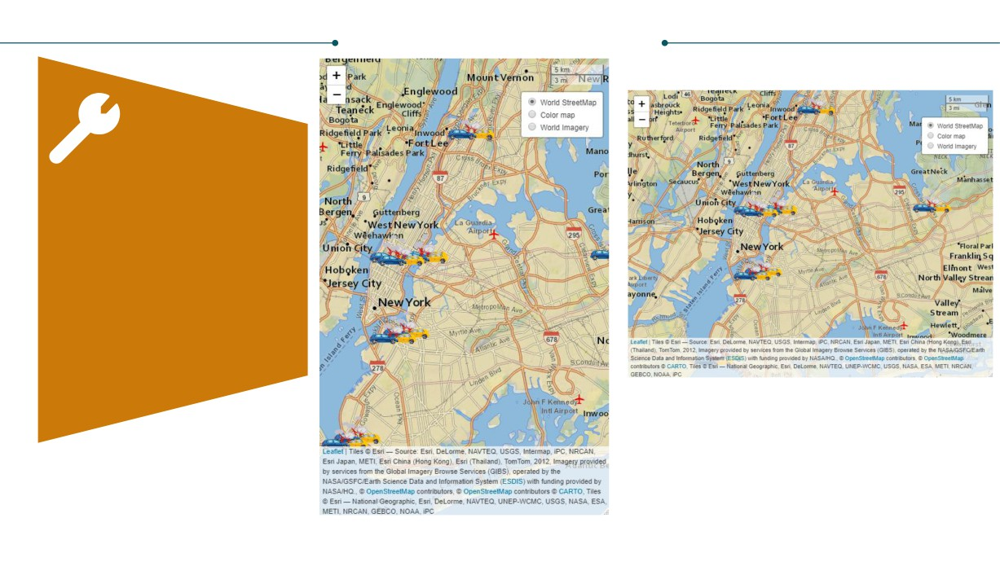
Modelling
Estimated
Dangerous Area
Map
on Weekends vs
Dangerous Area
from data
ESTIMATED
ORIGINAL

References
[1.](https://www.kaggle.com/new-york-city/nypd-motor-vehicle-collisions)
[https://www.kaggle.com/new-york-city/nypd-motor-vehicle-collisions](https://www.kaggle.com/new-york-city/nypd-motor-vehicle-collisions)
2.
https://stackoverflow.com/questions/21382681/kmeans-quick-transfer-stage-steps-exceeded-maximum
3. https://github.com/tidyverse/lubridate/issues/669
4. http://www.stat.columbia.edu/\~tzheng/files/Rcolor.pdf
5.
https://stackoverflow.com/questions/49951416/how-to-use-colornumeric-within-addcircles-in-leaflet
6.
https://medium.com/analytics-vidhya/a-guide-to-machine-learning-in-r-for-beginners-decision-trees-c24dfd490abb
7.
https://medium.com/@mueller.johannes.j/use-r-and-gganimate-to-make-an-animated-map-of-european-students-
[and-their-year-abroad-517ad75dca06](https://medium.com/@mueller.johannes.j/use-r-and-gganimate-to-make-an-animated-map-of-european-students-and-their-year-abroad-517ad75dca06)

Thank You
Ogulcan Ertunc
